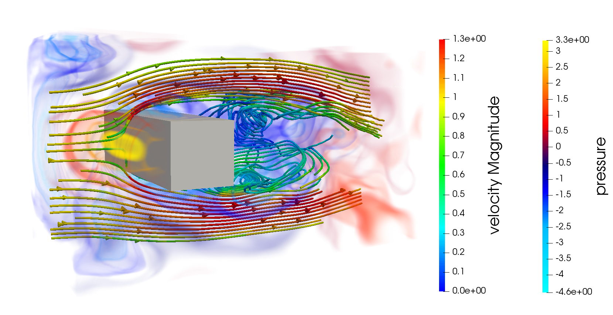
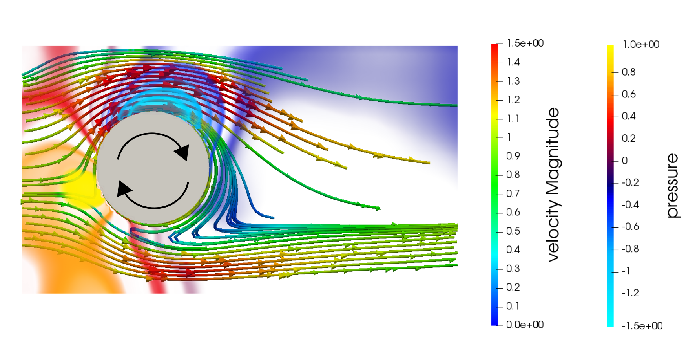

# Teaching the Incompressible Navier Stokes Equations to Fast Neural Surrogate Models in 3D

Hi!  
Do you want to perform some cool fluid simulations in 3D with CNNs?  
Do you want to train your own fluid models without having to worry about ground truth data?  
Then, this is the right repository for you! :)  

Here are some examples that were generated using a single neural surrogate model:  






In this repository, we show, how you can "teach" the incompressible Navier Stokes equations to fast neural surrogate models (e.g. a U-Net) using different time integration schemes (explicit / implicit / IMEX) on a Marker And Cell (MAC) grid.

## Publications
This repository complements our paper on:  
[Teaching the Incompressible Navier Stokes Equations to Fast Neural Surrogate Models in 3D](https://arxiv.org/abs/2012.11893)  
*Nils Wandel, Michael Weinmann, Reinhard Klein*, Physics of Fluids, 2021 ([Video](https://www.youtube.com/watch?v=tKcYJaJtHJE))
  
If you first want to start with some 2D simulations, then the following paper might be interesting for you as well:  
[Learning Incompressible Fluid Dynamics from Scratch - Towards Fast, Differentiable Fluid Models that Generalize](https://arxiv.org/abs/2006.08762)  
*Nils Wandel, Michael Weinmann, Reinhard Klein*, ICLR, 2021 ([Code](https://github.com/aschethor/Unsupervised_Deep_Learning_of_Incompressible_Fluid_Dynamics),[Video](https://www.youtube.com/watch?v=EU3YuUNVsXQ))


## Installation

First, create a new Conda-environment:  
```
conda create --name my_3d_fluid_env python=3.7  
source activate my_3d_fluid_env
```

Then, install the following packages:  
```
conda install pytorch torchvision cudatoolkit=10.2 -c pytorch  
conda install matplotlib statsmodels natsort tensorboard  
pip install opencv-python pyevtk
```  
... and you're done! :)  
The installation was tested on Ubuntu 18.04, but other operating systems should work as well. 
If you have troubles with cuda (e.g. because you don't have a GPU at hand), use the "\-\-cuda=f" option for all of the following python scripts.

## Interactive Demo

We provide you with a pretrained "pruned U-Net" model and a pretrained U-Net model so you can directly "dive into" some fluid simulations.  

To start the interactive demo using the pretrained pruned U-Net, run:  
```
python demo_interactive.py --dt=4 --net=pruned_UNet
```

If you want to use our pretrained, more accurate "full" U-Net, you first need to download the model from [Google Drive](https://drive.google.com/file/d/1HUYiye1SEc0anrTUDLyfJOT6R7sh92UA/view?usp=sharing) since the model is larger then 100 MiB and thus cannot be uploaded on GitHub. Then, copy the .state-file into the following folder:  
/Logger/net UNet; hs 15; dt 4.0/2021-01-28 17:26:17/states/  
... and run:  
```
python demo_interactive.py --dt=4 --net=UNet
```

The demo will open windows for the velocity and pressure fields averaged along the x,y and z axis respectively.  

By pressing the following keys, you can:

- "n": start a new (random) simulation  
- "p": play / pause a recording of the simulation. The recording will save the current velocity / pressure / boundary states of the fluid into .vtk-files (see vtk-folder). These .vtk-files are well suited for more in depth visualizions using e.g. paraview.  
- "q": quit the simulation  

There are several possibilities to interact with the fluid:

- By pressing the left mouse button, obstacles can be moved within the fluid domain.
- The following keyboard commands can be used to:  
"x": increase the flow speed  
"y": decrease the flow speed  
"v": increase the fluid's density rho  
"c": decrease the fluid's density rho  
"f": increase the fluid's viscosity mu  
"d": decrease the fluid's viscosity mu  
"s": increase the angular velocity (only for spinning objects)  
"a": decrease the angular velocity (only for spinning objects)  

## Train your own models

If you want to train you own models, you can call for example:  
```
python train.py --dt=4 --net=UNet --batch_size=10 --lr=0.001 --integrator=imex
```

For more information about all the training parameters, call:  
```
python train.py --help
```

If you want to follow the training progress with tensorboard, call:  
```
tensorboard --logdir=Logger/tensorboard --bind_all
```

After every epoch, the fluid models get automatically stored in the /Logger-folder and can be directly used by the interactive demo script as shown above.  
By specifying load_date_time / load_index, you can choose, which specific model you want to load (by default, the most recent model is chosen). E.g.:  
```
python demo_interactive.py --dt=4 --net=UNet --load_date_time="2021-01-28 17:26:17" --load_index=1500
```

## Add custom obstacles to the simulation

We provide you with a small Blender script (blender_voxelizer.py) so you can voxelize your own obstacles in Blender. 
This script generates .npy-files that can be copied into the /imgs-folder and added to the setups.py file as shown in lines 10-16. 
Note, that the object geometry must be closed to make the script work properly. If you want to check whether the voxelization was done correctly, you might want to have a look at the check_voxelization.py script. 

## License

Feel free to clone this repository and modify it! If it's of good use for you, give it a star and please cite our publications!
If there are questions left, just contact us: wandeln@cs.uni-bonn.de

## References

Our U-Net implementation follows the architecture described in:  
[3D U-Net: Learning Dense Volumetric Segmentation from Sparse Annotation](https://arxiv.org/abs/1606.06650)  
*Özgün Çiçek, Ahmed Abdulkadir, Soeren S. Lienkamp, Thomas Brox, Olaf Ronneberger*, CVPR, 2016
